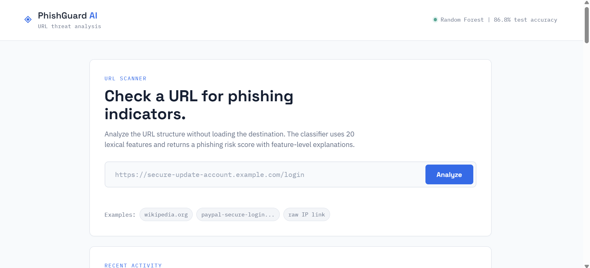
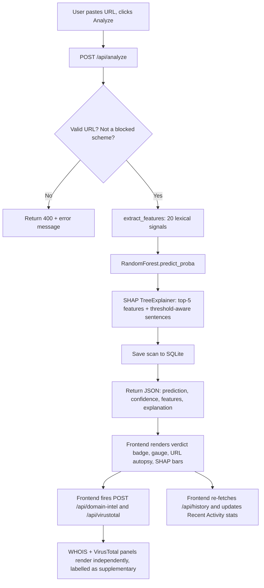
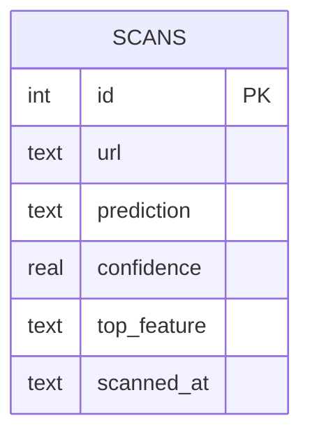

# PhishGuard AI
### Research-Based Hybrid AI Phishing Detection System - v2

PhishGuard AI classifies a pasted URL as **phishing** or **legitimate** using
a Random Forest model trained on 20 lexical (URL-string-only) features,
explains every prediction with **SHAP** in threshold-aware plain English,
and enriches the verdict with optional WHOIS domain intelligence and
VirusTotal reputation data. Built as a resume-ready project for the IBM
PBEL Cybersecurity Internship, then upgraded into a more complete,
production-shaped v2.




---

## 1. Features

- **20-feature lexical URL analysis** — length, structure, entropy, ratios,
  token stats, TLD reputation, and more (§9), computed with zero network
  calls.
- **Random Forest classifier** (86.5% accuracy, 0.939 ROC-AUC) benchmarked
  against a Logistic Regression baseline (79.1% accuracy).
- **SHAP explainability** - every prediction returns a ranked, plain-English
  list of *why*, compared against phishing-class averages from training
  (e.g. "URL length (91) exceeds the average phishing threshold (~75)").
- **RDAP domain intelligence** - registrar, creation/expiration dates,
  domain age, country - shown as clearly-labelled supplementary metadata,
  never mixed into the ML score.
- **Optional VirusTotal integration** - a second, third-party opinion when
  an API key is configured; silently hidden otherwise.
- **Research panel** - the underlying paper's title, key idea, gap, and how
  this project extends it, rendered live in the dashboard, not just in
  this README.
- **SOC-style dashboard** - threat gauge, verdict card, "URL autopsy"
  character-level breakdown, recent-activity stats, scan history, model
  dossier, and dataset statistics — custom HTML/CSS/JS, no frameworks.
- **SQLite scan history** - basic rate limiting, blocked-scheme validation,
  and graceful degradation everywhere a live network call could fail.

## 2. Screenshots

`docs/screenshots/dashboard_mockup.png` 

1. **Exhibit intake** - the URL scan bar.
2. **Recent activity** -session-level scan counters.
3. **Verdict card** - risk gauge, badge, confidence, and one-line summary.
4. **Exhibit A: URL autopsy** - annotated character breakdown.
5. **Exhibit B: extracted signals** - all 20 feature values.
6. **Exhibit C: SHAP explanation bars**.
7. **Domain intelligence + VirusTotal** - supplementary, clearly separated.
8. **Scan history (case log)**, **model dossier**, **dataset statistics**,
   and a collapsible **research background** panel.

## 3. Installation Guide

**Requirements:** Python 3.10+

```bash
cd project
python3 -m venv .venv
source .venv/bin/activate        # Windows: .venv\Scripts\activate
pip install -r requirements.txt

# Train the model (regenerates models/model.pkl, model_lr.pkl, metrics.json)
python models/train_model.py

# Run the app
python backend/app.py
# -> http://localhost:5000
```

`models/model.pkl` ships pre-trained, so training is optional unless you
change the feature set. Two integrations are fully optional and disable
themselves gracefully with no configuration:

```bash
# Optional: enables the VirusTotal panel
export VIRUSTOTAL_API_KEY="your-key-here"
```

WHOIS domain intelligence needs no key but does need outbound network
access on your host - it degrades gracefully (shows "unavailable") in any
sandboxed or offline environment.

## 4. Folder Structure

```
project/
├── backend/
│   ├── app.py              # Flask app factory + all routes
│   ├── config.py           # Environment-driven configuration
│   └── constants.py        # Shared limits (rate limit, blocked schemes, SHAP top-k)
├── database/
│   └── db.py                # SQLite schema + CRUD helpers
├── datasets/
│   └── phishing_dataset_raw.csv   # 11,430 labelled URLs (see §8)
├── docs/
│   ├── research.json         # Research-paper context, served by /api/research-info
│   └── screenshots/           # Dashboard screenshot(s)
├── models/
│   ├── train_model.py        # Training pipeline (RF + LR + thresholds)
│   ├── model.pkl              # Trained Random Forest (generated)
│   ├── model_lr.pkl           # Logistic Regression baseline (generated)
│   ├── scaler.pkl             # StandardScaler for the LR baseline
│   └── metrics.json           # Evaluation metrics + dataset stats (generated)
├── static/
│   ├── css/style.css         # Custom dashboard styling (no frameworks)
│   ├── js/main.js            # Frontend logic (vanilla JS, no frameworks)
│   └── img/favicon*.png       # Favicon
├── templates/
│   └── index.html             # Single-page dashboard
├── utils/
│   ├── feature_extractor.py  # 20-feature lexical URL extraction
│   ├── explainer.py           # SHAP explainability + threshold-aware phrasing
│   ├── domain_intel.py         # RDAP/WHOIS registration lookup (Phase 5)
│   └── virustotal.py           # Optional VirusTotal lookup (Phase 6)
├── Procfile / render.yaml
├── requirements.txt / .gitignore
└── README.md
```

## 5. Architecture

```
+------------------+   POST /api/analyze           +--------------------------+
|   Browser UI     |------------------------------>|   Flask backend          |
| (templates/ +    |                               |   backend/app.py         |
|  static/js)      |<------------------------------|                          |
+------------------+        JSON: verdict          | 1. extract_features()    |
       |                                           | 2. model.predict_proba   |
       | POST /api/domain-intel                    | 3. SHAP explain()        |
       | POST /api/virustotal        (fired after  | 4. save_scan() -> DB     |
       |      the verdict returns,    the verdict  +------------+-------------+
       |      non-blocking)           renders)                     |
       v                                                           v
utils/domain_intel.py                                    models/model.pkl
utils/virustotal.py                                        (Random Forest)
(WHOIS / VT -- informational,                               database/scans.db
 never feeds the ML model)                                    (scan history)
```

**Offline training pipeline** (run once, before the app starts):

```
datasets/phishing_dataset_raw.csv  -->  models/train_model.py  -->  models/model.pkl
   (11,430 labelled URLs)                * extract 20 lexical features    model_lr.pkl
                                          * train RF + LR                  metrics.json
                                          * evaluate, compute thresholds   (feature importance,
                                                                            per-feature phishing
                                                                            averages, dataset stats)
```

## 6. Flowchart - single scan request



## 7. ER Diagram



Only one table is needed for this project's scope. WHOIS and VirusTotal
results are fetched live and not persisted - they're presented as
point-in-time supplementary context, not part of the scan's permanent
record.

## 8. Dataset

`datasets/phishing_dataset_raw.csv` — 11,430 real URLs (5,715 phishing /
5,715 legitimate, perfectly balanced), from the raw `url,status` columns of:

> Hannousse, A. & Yahiouche, S. (2021). "Towards benchmark datasets for
> machine learning based website phishing detection: An experimental
> study." Engineering Applications of Artificial Intelligence, 104, 104347.

PhishGuard AI re-derives its own 20-feature lexical vector from the raw URL
strings rather than using the dataset's original 87 pre-computed columns
(most of which require live WHOIS/DNS/page-content lookups), to keep
predictions instant and offline-safe. Domain-age/WHOIS data is still shown
to the user (§11) — just kept out of the model's feature vector.

## 9. ML Pipeline

### Feature set (20 features)

| # | Feature | What it captures |
|---|---|---|
| 1 | `url_length` | Total character count |
| 2 | `num_dots` | Dot count |
| 3 | `num_hyphens` | Hyphen count |
| 4 | `has_ip` | Raw IPv4/IPv6 host instead of a domain |
| 5 | `has_https` | Scheme is HTTPS |
| 6 | `suspicious_keyword_count` | Matches against a phishing-lure wordlist |
| 7 | `num_digits` | Digit count |
| 8 | `num_subdomains` | Subdomain label count |
| 9 | `has_at_symbol` | Contains `@` (classic host-spoofing trick) |
| 10 | `is_shortened` | Known link-shortening service |
| 11 | `shannon_entropy` | Character-distribution randomness |
| 12 | `digit_ratio` | Digits divided by URL length |
| 13 | `special_char_ratio` | Non-alphanumeric chars divided by URL length |
| 14 | `longest_token_length` | Longest delimiter-split token |
| 15 | `suspicious_tld` | TLD on a commonly-abused list |
| 16 | `max_char_repeat` | Longest run of one repeated character |
| 17 | `path_depth` | Non-empty `/`-segments in the path |
| 18 | `query_param_count` | Query-string parameter count |
| 19 | `encoded_char_count` | Percent-encoded sequences (`%20`, etc.) |
| 20 | `suspicious_keyword_density` | Keyword count divided by URL length |

Every feature is O(len(url)) or cheaper - no DNS, registration lookup, or page fetches in
the model's hot path.

### Results (80/20 stratified split, 2,286 held-out test URLs)

| Metric | Random Forest | Logistic Regression |
|---|:-:|:-:|
| Accuracy | **86.5%** | 79.1% |
| Precision | 87.5% | 82.1% |
| Recall | 85.1% | 74.5% |
| F1 score | 86.3% | 78.1% |
| ROC-AUC | **0.939** | 0.881 |

Random Forest beats the linear baseline on every metric - consistent with
the base paper's finding that ensemble methods outperform individual/linear
classifiers. Run `python models/train_model.py` to reproduce; exact numbers
may vary slightly run to run.

Top 5 features by Random Forest importance: `max_char_repeat` (0.175),
`digit_ratio` (0.097), `num_digits` (0.080), `longest_token_length` (0.070),
`shannon_entropy` (0.069) - notably, four of the five top signals are new
in v2, which is why accuracy improved from v1's 81.3% (10 features) to
86.5% (20 features) on the same dataset and model family.

## 10. Explainability

`utils/explainer.py` wraps a `shap.TreeExplainer` around the Random Forest
and turns the top-5 SHAP-ranked features into threshold-aware sentences,
e.g.:

- "This URL contains an unusually high number of subdomains (4)."
- "The URL length (91 characters) exceeds the average phishing threshold (~75)."
- "The character entropy (4.8 bits/char) is unusually high, suggesting a randomly generated or obfuscated URL."
- "Suspicious keyword detected (3 matches against a known phishing-lure wordlist)."

Thresholds come from `models/train_model.py`, which computes each feature's
mean value across the training set's phishing-labelled rows and stores it
in `metrics.json` - so "average phishing threshold" is a real, computed
number, not a hardcoded guess. A one-line `summary` field (e.g. "Flagged
primarily due to: shannon entropy, num digits, and max char repeat.") is
also generated for the verdict card.

## 11. Domain Intelligence & VirusTotal (Phases 5 & 6)

Both panels are **supplementary metadata, not part of the ML verdict** —
the dashboard labels them explicitly ("not part of the ML verdict" /
"third-party opinion") so the distinction is never ambiguous.

- **Domain intelligence** (`utils/domain_intel.py`) performs a live WHOIS
  lookup (registrar, creation/expiration dates, computed domain age,
  country). Uses HTTPS-based RDAP lookups with bounded timeouts and broad exception handling -
  any failure returns `{"available": false, "reason": ...}` instead of a
  500 error.
- **VirusTotal** (`utils/virustotal.py`) is entirely optional. With no
  `VIRUSTOTAL_API_KEY` set, the endpoint short-circuits before making any
  network call and the panel hides itself. With a key set, it reports
  vendor flag counts and a plain recommendation.

## 12. Research Background

**Paper:** Alzubi, R., Bishtawi, T., & Kassem, H. (2025). "Improving Web
Security through Machine Learning: A Feature-Based Methodology for
Detecting Phishing URLs." Engineering, Technology & Applied Science
Research, 15(5), 26845–26851. DOI:
[10.48084/etasr.12015](https://doi.org/10.48084/etasr.12015) (Scopus Q2,
CC-BY 4.0).

**Why this paper:** Recent (2025), peer-reviewed, and directly on-topic —
it benchmarks Random Forest against Decision Tree, SVM, and XGBoost on
lexical/host/content URL features and finds ensemble methods, especially
Random Forest, consistently win. This project reproduces that specific,
checkable claim at smaller scale (§9).

**Research gap:** The paper reports strong aggregate accuracy but gives no
end user a way to see *why* a specific URL was flagged, and ships no
interactive tool - a common gap across classic phishing-ML literature.

**How this extends it:** PhishGuard AI implements the paper's core
methodology (URL feature extraction into a Random Forest, benchmarked
against a linear baseline) using a 20-feature lexical-only subset for zero
network dependency, then closes the explainability gap with threshold-aware
SHAP output, and packages the whole thing as a live, deployable dashboard
rather than an offline experiment.

**Future work:** see the in-app Research panel (`/api/research-info`, also
`docs/research.json`) - it covers deep-scan host/content features, a
managed Postgres swap, a browser extension, model-drift monitoring, and
threat-intel feed integration.

*This section is also rendered live in the running app* - see the
"Research background" panel on the dashboard, so the research framing is
visible in the product itself, not just in this file.

## 13. Deployment (Render)

1. Push this project to a GitHub repository.
2. On [render.com](https://render.com), **New -> Blueprint**, point it at
   your repo — it picks up `render.yaml` automatically. Or create a
   **New -> Web Service** manually:
   - **Build command:** `pip install -r requirements.txt && python models/train_model.py`
   - **Start command:** `gunicorn backend.app:app --bind 0.0.0.0:$PORT`
3. Optional: set `VIRUSTOTAL_API_KEY` in the Render environment variables
   to enable the VirusTotal panel.
4. Render's free-tier filesystem is **ephemeral** — SQLite scan history
   resets on redeploy/restart. For persistent history, swap
   `database/db.py` for managed Postgres (see Future Improvements).

## 14. Future Improvements

- Host/content feature family from the base paper (WHOIS/domain age, DNS,
  page HTML) behind an optional "deep scan" toggle, to approach the
  paper's reported accuracy ceiling.
- Persistent database (managed Postgres) so scan history survives
  redeploys.
- Browser extension wrapping `/api/analyze` for real-time link checking.
- Model-drift monitoring and scheduled retraining as phishing patterns
  evolve.
- Threat-intelligence feed cross-checks (PhishTank, OpenPhish) alongside
  VirusTotal.

## 15. Tech Stack

- **ML:** scikit-learn (RandomForestClassifier, LogisticRegression), SHAP
- **Backend:** Flask, Flask-Limiter, SQLite, python-whois, requests
- **Frontend:** vanilla HTML / CSS / JavaScript - no frameworks
- **Deployment:** Render (gunicorn WSGI server)

## 16. Audit Notes (v1 -> v2)

A short summary of what changed and why, for transparency:

- **Bugs fixed:** `predict_proba` fed a raw list instead of a properly
  column-named DataFrame (sklearn warning); a `javascript:`/`data:` URL
  scheme could bypass validation because the "assume http://" fallback ran
  *before* the scheme check — fixed by checking the raw input's scheme
  first (`backend/app.py::_validate_url`).
- **Security:** added per-IP rate limiting (`Flask-Limiter`, 20 requests/
  minute on `/api/analyze`, `/api/domain-intel`, `/api/virustotal`) and
  explicit scheme blocking (`javascript`, `data`, `vbscript`, `file`).
- **ML:** feature set expanded from 10 to 20 lexical signals; accuracy rose
  from 81.3% to 86.5% on the same model family and dataset.
- **Explainability:** SHAP output rewritten from generic "raises/lowers"
  phrasing to threshold-aware, feature-specific sentences.
- **Code quality:** added `backend/constants.py` as a single source of
  truth for rate limits and blocked schemes; added `/api/lexicon` so the
  frontend's "URL autopsy" highlighting always matches the backend's
  keyword/TLD/shortener lists instead of maintaining a second hardcoded
  copy in JavaScript.

## 17. License & Attribution

Educational/portfolio use as part of the IBM PBEL Cybersecurity
Internship. Dataset and research paper are cited above under their
respective licenses (CC-BY 4.0 for both).
